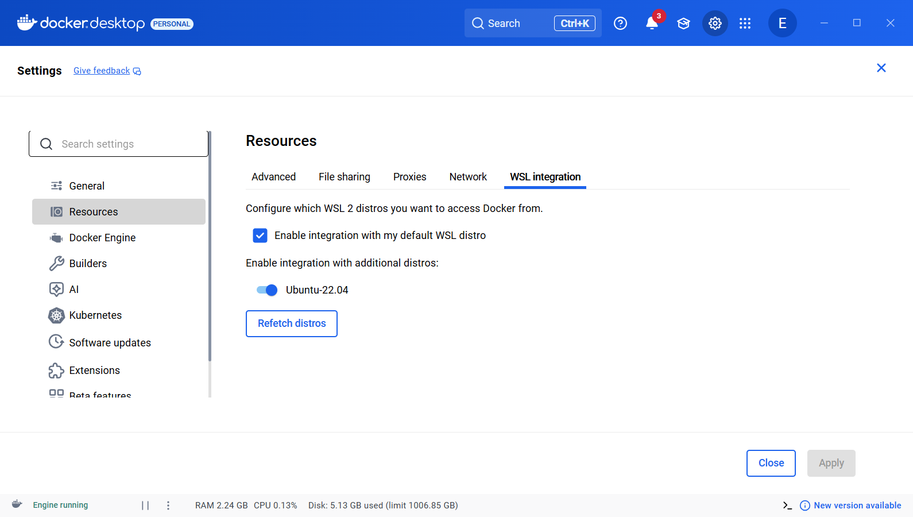
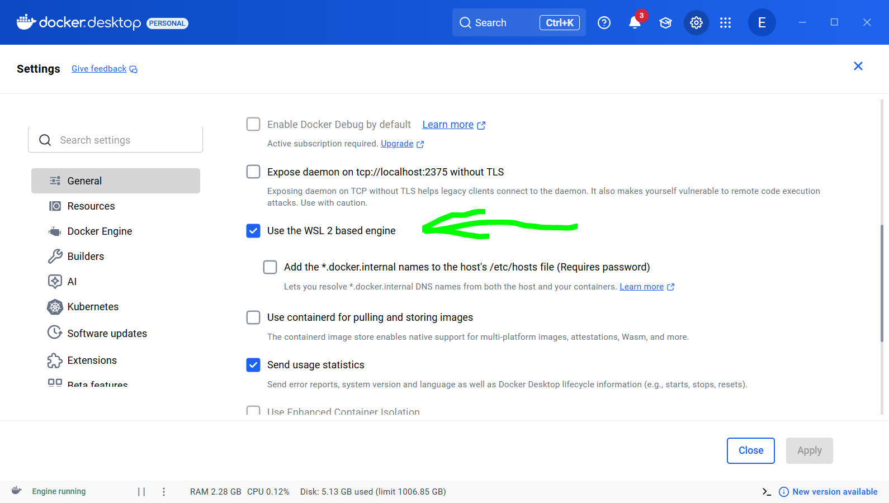

Example folder structure of ros2_ws

my_ws/
 ├── src/     <-- your packages go here
 │    ├─ my_robot_description/
 │    ├─ my_robot_gazebo/
 │    └─ my_robot_control/
 ├── build/   <-- created automatically by colcon
 ├── install/ <-- created automatically by colcon
 └── log/     <-- also created automatically

AutoCombat /
    ros2_docker_ws /
        .devcontainer /
            Dockerfile
            devcontainer.json
        ros2_ws
            src/
            (...)
            

Setup:
https://apps.microsoft.com/detail/9pn20msr04dw?hl=en-US&gl=US

https://github.com/Https404PaigeNotFound/ros-humble-docker-demo/blob/main/docs/setup-from-scratch.md
looking to be the best option

(WSL!)
https://docs.ros.org/en/humble/Tutorials/Advanced/Simulators/Webots/Installation-Windows.html

ROS 2 Humble Hawksbill is made for Ubuntu 22.04 (Jammy Jellyfish).

(Chat GPT setup)
pip install vcstool

(Windows setup to install docker)
https://docs.docker.com/desktop/setup/install/windows-install/

https://docs.ros.org/en/humble/How-To-Guides/Setup-ROS-2-with-VSCode-and-Docker-Container.html#install-remote-development-extension
(From here)

How to setup Gazebo simulation:

https://docs.ros.org/en/humble/Tutorials/Advanced/Simulators/Gazebo/Gazebo.html

Example github repo of X-drive mecanum ROS2 and Gazebo project:
https://github.com/MickySukmana/holonomic

Making a urdf:
https://docs.ros.org/en/humble/Tutorials/Intermediate/URDF/Building-a-Visual-Robot-Model-with-URDF-from-Scratch.html

How to generate a urdf from Fusion360:
https://github.com/dheena2k2/fusion2urdf-ros2

How to generate a urdf from Onshape:
https://github.com/Rhoban/onshape-to-robot?tab=readme-ov-file

ROS2_Controller for our omni directional robot:
https://control.ros.org/humble/doc/ros2_controllers/doc/mobile_robot_kinematics.html#omnidirectional-wheeled-mobile-robots

ros2_control ('hardware-agnostic control framework for abstracting hardware and low-level control for 3rd party solutions like MoveIt2 and Nav2 systems.'):
https://control.ros.org/rolling/doc/resources/roscon2025_workshop.html

Nav2 (highlevel control system, behavior trees, nav, state estimation):
https://docs.nav2.org/concepts/index.html#controllers